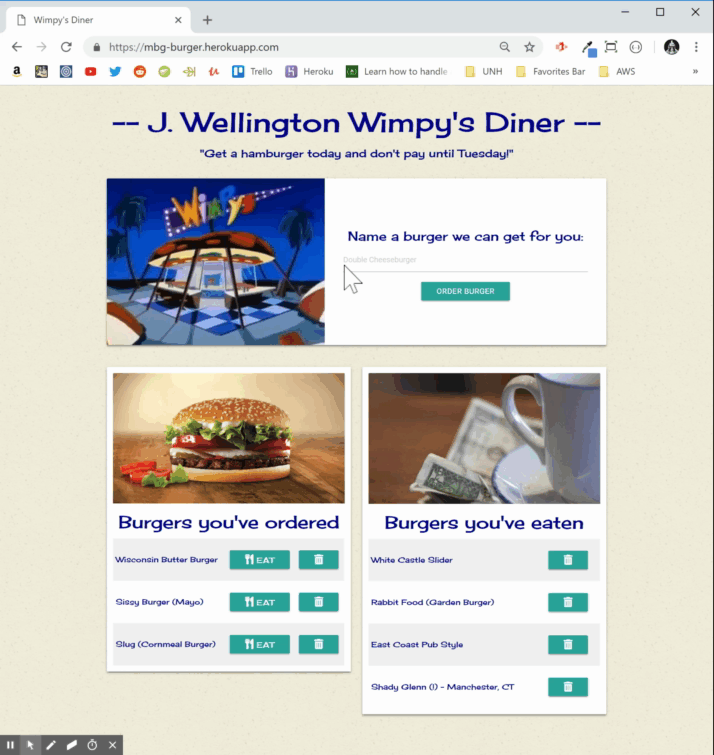

# "J. Wellington Wimpy's Burger App" - a full stack demo application (also known as "Eat Da Burger")  
A burger logging application implemented with MySQL, Node, Express, Handlebars and a homemade ORM using a MVC design pattern  
  
try it at:  https://mbg-burger-sequelize.herokuapp.com  
  
## Overview    
J. Welligton Wimpy's burger app is a simple database app to demostrate full stack capabilities, remote deployment and persistant storage over time. The application features a burger ordering theme. Enter a burger you'd like to eat and it adds it to the "Burger's you've ordered" list. Once there, you can eat it and have it moved to the eaten burger list. Once eaten a burger can't be recovered (of course). It features trashcan buttons to delete any burger from either list (and from the database).  
  
### Who is J. Wellington Wimpy?  
For those too young to remember,  J. Wellington Wimpy was the character from the depression era Popeye cartoons that was always mooching hamburgers and promising to pay later. This diner app is a homage to that congenial fellow.  
  
## Wimpy's Diner App capabilties  
  1) __Order a Burger__ - calls a POST method to add a burger to the MySQL database and mark it as uneaten  
  2) __Uneaten burgers__ - displayed after GET method to itemize a list of burgers from the database that do not have a devoured flag  
  3) __Eaten Burger__ - displayed after GET method to list the burgers from the database that have the devoured flag set  
  4) __Eat__ - call UPDATE method to set a burger's flag to devoured and calls GET to redisplay the lists (moves it from uneaten to eaten list)  
  5) __Trash__ - call the DELETE method to purge the burger from the database  
  
## Demonstration of Functionality    
    
The gif provides a quick overview of the functionality (input validation checks not shown):    
  
  

## API Endpoints
  
|HTTP Action | Endpoint |  Parms | Input | Output | Description |
| ---------- | -------- | ------ | ----- | ------ | ----------- |
| GET        | / | None         | n/a | JSON burgers[] | Default route to the home page to display all burgers |
| POST       | /api/burgers     | n/a | JSON burger | index.html | adds the passed burger object to the database   |
| UPDATE     | /api/burgers/:id | id | n/a |index.html | updates the devoured state of the specified burger in the database based on id|
| DELETE     | /api/burgers/:id | id | n/a | number deleted |  deletes the specified burger from the database based on id |
     
## Developer notes  
- **.env:**  environment variables used by dotenv package holding secret keys and passwords for mySQL, not included in GIT    
- **.gitignore.** - ubiquitous git file to keep node modules and passwords out of GIT  
- **server.js** - the main entry point of on the server side, sets up the web server and endpoints  
- **controllers/burgerControllers.js** - registers HTTP endpoints with the express router (POST, GET, UPDATE, DELETE) 
- **config/config.js** - the database configuration file, allows for local or heroku deployments  
- **models/burger.js** - our business logic imnplemented in sequelize, autogenerates the necessary mysql tables  
- **models/index.js** - generated by sequelize, *tweaked to use config.js* instead of config.json to allow for dotenv proxies  
- **public/...** - the front end of the app minus handlebars, contains jQuery event logic and the CSS, images, fonts and such  
- **views/...** - the handlebars files, holds the html template logic and main UI look & feel  
  
## How to install/run the application    
1. Download and install the latest version of Node.js following the website instructions for your platform  
   ` https://nodejs.org/en/download/`   
2. Clone this repository into a clean diretory  
   `$ git clone <repository url>`  
3. Bring down the latest package dependencies using node package manager  
   `npm install`  
4. Download and install the latest version of mySQL  
   ` https://www.mysql.com/downloads/`   
5. This package requires a database configuration and password for mySQL. The parameters are captured in a .env file which must be supplied to the root directory of the project.  Use the installation of mySQLWorkbench to configure the installation and then use your favorite IDE to enter the following keys-values pairs to the .env file with your id and password:  
  
| File        | Parameters needed for mySQL                                          |
| ----------- | -------------------------------------------------------------------- |
| .env        | DB_HOST=__your mySQL host name__   (usually localhost)               | 
|             | DB_USER=__your mySQL account__     (usually root)                    |
|             | DB_PWD=__your mySQL password__                                       |
|             | DB_PORT=__your mySQL port__        (usually 3306)                    |
|             | DB_NAME=__burgers_db__                                               |
  
__Note:__  the .gitignore file is coded to prevent your config and password from being shared in your git repository publically    

1. For local deployments, create the database in mySQLWorkbench,  sequelize will do the rest  
2. Run the node server app from the command line  
   `node server.js`  
  
## Technology Used  
    
| Package/Interface | Version     | Description                                                              |
| ----------------- | ----------- | ------------------------------------------------------------------------ |
| Node.js           | __11.1.0__  | Main javascript engine for this application                              |
| npm mySQL         | __2.16.0__  | mySQL relational database management system & workbench                  |
| npm express       | __4.16.4__  | a node based web server framework                   |
| npm express-handlebars| __3.0.0__  |a node based html templating framework |
| npm dotenv        | __6.2.0__   | Utility package to hide the secret keys in a .env file and away from git |
| mySQL Workbench   | __8.0.13__  | mySQL IDE to run schema.sql database configuration file                  | 
| jawsDB            |             | a mySql compatible relational datbase supported for Heroku remote deployments | 
  
## Authors    
Michael Galarneau - Initial work - five0ffour  
January, 2018  
  
## Acknowledgements    
DotEnv - environment variables management tool  
mySql - the ubiquitous relational database management system  
Heroku - an Amazon hosted cloud deployment framework  
subtlepatterns.com - background textured wallpaper  
Burger King - Mall of America BK's tasteful burger image  
Cherry Soda Font - FontDiner.com  
Font Aweseome - for the trashcan & dinner fork icons  
E.C. Segar - for his entertaining comic strip & characters    